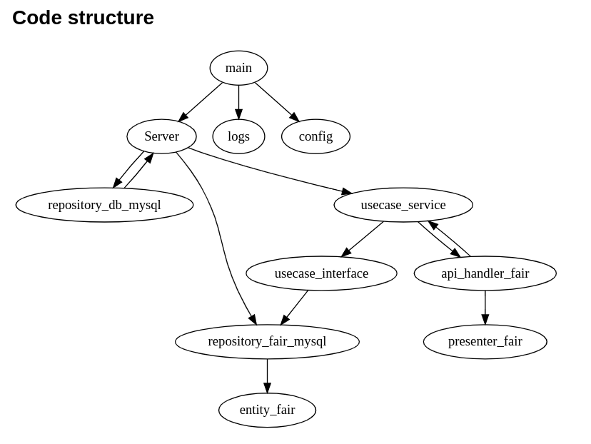

<h2 align="center">API Go FAIR</h2>
The Project is an API developed in golang that exposes data from fairs in general, registered in a MySQL database. This API, when started, is available at the address "http://localhost:5001" and can be accessed via a browser or any tool that uses the HTTP protocol and uses the resources (POST/GET/PUT/PATCH/DELETE). For testing the API is also available on port 5000 but in this case the data is saved in memory, which is lost as soon as the application is finished.

The project has a .json file (FairTestsMySQL.postman_collection.json/FairTestsInMemory.postman_collection.json) exported from the POSTMAN tool that can be used to test the endpoints.

All source codes then in the src folder and were organized according to the Clean architecture.
It also has a Docker folder with a docker-composer file that can be used to assemble all the environment needed to run the application. In this it starts a MySQL database service that is available on port 3307 and also raises the DOCKER of the FAIR application which is the API in question.
(Sorry for the English. But I tried to make it as accessible as possible to most of the developer community.)
<p>
  
  <a href="#" target="_blank">
    
  </a>
</p>


## Code structure
<!-- ``` dot {engine="dot"}
digraph CODE {
 
                    main->handler_server
                    main->logs
                    main->config

    handler_server->repository_db_mysql
    repository_db_mysql->handler_server

    handler_server->repository_fair_mysql->entity_fair
    handler_server->usecase_service->handler_fair->presenter_fair
           handler_fair->usecase_service
    usecase_service->usecase_interface->repository_fair_mysql
}
``` -->
<p>
  
</p>


<!-- <p>
  
</p> -->

- Go API Fair. It also has a CRUD.

## Requirements/dependencies
- GO
- Docker
- Docker-compose
- MySQL

## Getting Started

- After installing Go and setting up your GOPATH, 
- [How To install Go](https://github.com/larien/aprenda-go-com-testes/blob/master/primeiros-passos-com-go/instalacao-do-go.md) 


- [Clone project](https://github.com/marcovargas74/m74-fair-api.git)
```sh
git clone https://github.com/marcovargas74/m74-fair-api.git
```

- HOW TO RUN   
```sh
 cd m74-fair-api

 ## start dockers
 make all

 ## stop dockers
 make stop

 ## start API in dev MODE 
 make dev

 ## Run API in Local Machine and conect to a MySql in addr localhost:3037 To Default. 
 ## But can change addr and other config setting the .env file used the Envirment Var to set BD configure 
 make run

```

> :warning: **DB can take up to 3 minutes to start**: Be very careful here!

## Running Project Locally Without Using DOCKER
- Enter in project

```sh
cd m74-fair-api/src/fair
```

- Build e RUN golang project
```sh
 ## Run compiled project
go run main.go
```

- Build golang project

```sh
go build -o main.go
```
- Run api(port 5000)
```sh
 ## Run compiled project in Test Mode
 TYPE_APP=TEST go run main.go
```

- OTHER FEATURES OF MAKE
```sh

 ## Test All Code (go test)
 make test

 ## check test coverage (go coverage) and save in go-cover-fair.tmp
 make cover

 ## Run make test and cover  
 make tests

```


## HOW TO CONFIGURE
```sh
The application uses environment variables to program itself.
These variables must be configured before running the program. Otherwise, they assumed the default values.
Next are the environment variables used in the APP 

# API Section
TYPE_APP=PROD
TYPE_APP=DEV
SERVER_API_PORT_MEM=:5000
SERVER_API_PORT_SQL=:5001
LOG_FILE=./fairAPIdocker.log

# Database Section
DB_USER=root
DB_PASSWORD=my-secret-pw
DB_DATABASE=fairAPI
DB_IP=localhost
DB_PORT=3307

```

```sh
## Example: Configure to DEV MODE
TYPE_APP=DEV
```

  
<p> 
<h1 style="background-color:green;"></h1>

 
 <h2 align="center">Sequência Para testar a API Go FAIR</h2>


```sh


#Para rodar a primeira vez é necessario usar o comando: 
make dev

#Isso, irá compilar a aplicação FAIR e montar o ambiente iniciando o
#  Docker container do banco de dados MySQL ficando disponível na porta 3037. 
#  Foi escolhido esta porta para evitar conflito caso a máquina host já possua 
#  um MySQL rodando na porta default que é a 3036. 

#Depois disso o sistema já deve estar pronto para ser testado, mas isso é 
#  necessário somente na primeira vez, pois o Docker do BD MySQL fica rodando
#  e a aplicação FAIR pode ser finalizada e iniciada quantas vezes for
#  necessário. Para isso, só é preciso rodar o comando:

make run 

# Atenção: Ocorreu no decorrer do desenvolvimento, uma demora para a aplicação
#  se conectar ao MySQL na primeira vez que foi rodado o comando Make DEV. 
#  Isso porque o Docker do MySQL demora um pouco pra ficar disponível. 
#  Mas foi incluido uma proteção para tentar se conectar o banco toda vez que for
#  acessado algum endpoint. Caso, isso ocorra, Proceda da seguinte forma: 
#    1. Finalize somente a aplicação FAIR
#    2. Espere alguns poucos minutos(3 minutos- sugestão) 
#    3. Execute o comando: 
make Run   

# Após a aplicação FAIR iniciar, a API fica disponivel em duas portas  http, 
#   a porta 5000 e a porta 5001. Quando se conecta no endereço http://localhost:5000, 
#   a api salva e manipula os dados em memória, já no endereço http://localhost:5001 
#   os dados são acessados no MySQL.

## Para mais detalhes de outros comandos acesse o arquivo Makefile na raiz
#    do projeto.

```
<h1 style="background-color:green;"></h1>

</p>


## API Request

| Endpoint        | HTTP Method           | Description                  |
| --------------- | :-------------------: | :--------------------------: |
| `/fairs/fairs/import/{file}`   | `POST`                 | `Import Values from .csv file`        |
| `/fairs`        | `POST`                | `Create a New Fair`          |
| `/fairs`        | `GET`                 | `List All Fairs`             |
| `/fairs/{id}`   | `GET`                 | `Return a Fair By ID`        |
| `/fairs?key=value`   | `GET`                 | `Return a Fair By key`       |
|                 |                       |                              |       
| `/fairs/{id}`   | `PUT`                 | `Update all data Fair By ID` |
| `/fairs/{id}`   | `PATCH`               | `Update only some data of the fair By ID`  |
| `/fairs/{id}`   | `DELETE`              | `Delete a Fair By ID`        |


## Test endpoints API using curl

- #### Import Values from .csv file
> :warning: **This import can take up to 3 minutes to complete**: Take a coffe!
`Request`
```bash
curl -i --request POST 'http://localhost:5000/fairs/import/defaultValues.csv' 
```
`Response`
```body
HTTP/1.1 200 OK
Date: Sun, 28 Aug 2022 17:28:16 GMT
Content-Length: 41
Content-Type: text/plain; charset=utf-8

Sucesso ao Importar dados do arquivo .CSV

```

- #### Creating a new FAIR

`Request`
```bash
curl -i --request POST 'localhost:5000/fairs' \
--header 'Content-Type: application/json' \
--data-raw '{
    "name": "PRACA SANTA HELENA",
    "District": "VILA PRUDENTE",
    "Region5": "Leste",
    "neighborhood" :"VL ZELINA"
}'
```

`Response`
```json
HTTP/1.1 200 OK
Content-Type: application/json
Date: Sun, 28 Aug 2022 17:21:25 GMT
Content-Length: 129
{
    "id": "c24c2967-8599-494e-8685-f6ec681278df",
    "name": "PRACA SANTA HELENA",
    "district": "VILA PRUDENTE",
    "region5": "Leste",
    "neighborhood": "VL ZELINA"
}
```

- #### Listing ALL FAIRS

`Request`
```bash
curl -i --request GET 'localhost:5000/fairs'
```

`Response`
```json
HTTP/1.1 200 OK
Content-Type: application/json
Date: Sun, 28 Aug 2022 17:24:47 GMT
Content-Length: 570

[
    {
        "id": "e55887a9-2752-4009-9351-d3dc14d23675",
        "name": "MAR PAULISTA",
        "district": "PEDREIRA",
        "region5": "Sul",
        "neighborhood": "PEDREIRA"
    },
    {
        "id": "c24c2967-8599-494e-8685-f6ec681278df",
        "name": "PRACA SANTA HELENA",
        "district": "VILA PRUDENTE",
        "region5": "Leste",
        "neighborhood": "VL ZELINA"
    }
    .
    .
    .
]

```


- #### Return a FAIR By ID

`Request`
```bash
curl -i --request GET 'http://localhost:5000/fairs/c24c2967-8599-494e-8685-f6ec681278df'
```

`Response`
```json
    {
        "id": "c24c2967-8599-494e-8685-f6ec681278df",
        "name": "PRACA SANTA HELENA",
        "district": "VILA PRUDENTE",
        "region5": "Leste",
        "neighborhood": "VL ZELINA"
    }

```

- #### Return a FAIR By Name

`Request`
```bash
curl -i --request GET 'http://localhost:5000/fairs?name=santa'
```

`Response`
```json
HTTP/1.1 200 OK
Content-Type: application/json
Date: Sun, 28 Aug 2022 17:24:47 GMT
Content-Length: 570
[

    {
        "id": "4677b3c4-1542-4d23-a8b6-adf35acb8b5f",
        "name": "VILA FORMOSA",
        "district": "VILA FORMOSA",
        "region5": "Leste",
        "neighborhood": "VL FORMOSA"
    },
    {
        "id": "5c88fd1c-a788-4437-a49c-0a71ed9e7a4a",
        "name": "VILA FORMOSA",
        "district": "VILA FORMOSA",
        "region5": "Leste",
        "neighborhood": "VL FORMOSA"
    }
    .
    .
    .
]

```

- #### Return a FAIR By district

`Request`
```bash
curl -i --request GET 'http://localhost:5000/fairs?district=VILA
```

`Response`
```json
HTTP/1.1 200 OK
Content-Type: application/json
Date: Sun, 28 Aug 2022 17:24:47 GMT
Content-Length: 570
[

    {
        "id": "4677b3c4-1542-4d23-a8b6-adf35acb8b5f",
        "name": "VILA FORMOSA",
        "district": "VILA FORMOSA",
        "region5": "Leste",
        "neighborhood": "VL FORMOSA"
    },
    {
        "id": "5c88fd1c-a788-4437-a49c-0a71ed9e7a4a",
        "name": "VILA FORMOSA",
        "district": "VILA FORMOSA",
        "region5": "Leste",
        "neighborhood": "VL FORMOSA"
    }
    .
    .
    .
]

```
- #### Return a FAIR By region5

`Request`
```bash
curl -i --request GET 'http://localhost:5000/fairs?region5=este'
```

`Response`
```json
HTTP/1.1 200 OK
Content-Type: application/json
Date: Sun, 28 Aug 2022 17:24:47 GMT
Content-Length: 570
[

    {
        "id": "4677b3c4-1542-4d23-a8b6-adf35acb8b5f",
        "name": "VILA FORMOSA",
        "district": "VILA FORMOSA",
        "region5": "Leste",
        "neighborhood": "VL FORMOSA"
    },
    {
        "id": "5c88fd1c-a788-4437-a49c-0a71ed9e7a4a",
        "name": "VILA FORMOSA",
        "district": "VILA FORMOSA",
        "region5": "Leste",
        "neighborhood": "VL FORMOSA"
    }
    .
    .
    .
]

```
- #### Return a FAIR By neighborhood

`Request`
```bash
curl -i --request GET 'http://localhost:5000/fairs?neighborhood=VL'
```

`Response`
```json
HTTP/1.1 200 OK
Content-Type: application/json
Date: Sun, 28 Aug 2022 17:24:47 GMT
Content-Length: 570
[

    {
        "id": "4677b3c4-1542-4d23-a8b6-adf35acb8b5f",
        "name": "VILA FORMOSA",
        "district": "VILA FORMOSA",
        "region5": "Leste",
        "neighborhood": "VL FORMOSA"
    },
    {
        "id": "5c88fd1c-a788-4437-a49c-0a71ed9e7a4a",
        "name": "VILA FORMOSA",
        "district": "VILA FORMOSA",
        "region5": "Leste",
        "neighborhood": "VL FORMOSA"
    }
    .
    .
    .
]

```


- #### Update all data Fair By ID

`Request`
```bash
curl -i --request PUT 'localhost:5000/fairs/c24c2967-8599-494e-8685-f6ec681278df' \
--header 'Content-Type: application/json' \
--data-raw '{
    "name": "PRACA NOVA",
    "District": "VILA NOVA",
    "Region5": "Sul",
    "neighborhood" :"VL NOVA"
}'
```

`Response`
```json
HTTP/1.1 200 OK
Content-Type: application/json
Date: Sun, 28 Aug 2022 17:21:25 GMT
Content-Length: 129

{
    "id": "c24c2967-8599-494e-8685-f6ec681278df",
    "name": "PRACA NOVA",
    "district": "VILA NOVA",
    "region5": "Sul",
    "neighborhood": "VL NOVA"
}
```

- #### Update only some data of the fair By ID

`Request`
```bash
curl -i --request PATCH 'localhost:5000/fairs/c24c2967-8599-494e-8685-f6ec681278df' \
--header 'Content-Type: application/json' \
--data-raw '{
    "Region5": "Norte",
    "neighborhood" :"NovoBairro"
}'
```

`Response`

```json
HTTP/1.1 200 OK
Content-Type: application/json
Date: Sun, 28 Aug 2022 17:21:25 GMT
Content-Length: 129

{
    "id": "c24c2967-8599-494e-8685-f6ec681278df",
    "name": "PRACA NOVA",
    "district": "VILA NOVA",
    "region5": "Norte",
    "neighborhood": "NovoBairro"
}
```


- #### Delete a Fair By ID

`Request`
```bash
curl -i --request DELETE 'http://localhost:5000/fairs/c24c2967-8599-494e-8685-f6ec681278df' 
```
`Response`
```body
HTTP/1.1 200 OK
Date: Sun, 28 Aug 2022 17:28:16 GMT
Content-Length: 23
Content-Type: text/plain; charset=utf-8

Sucesso ao deletar dado

```


## Code status
- Development

## Next Steps 
- Add more tests
- make a endpoint to configure api
- [TO DO](https://github.com/users/marcovargas74/projects/3/views/1)


## Author
- Marco Antonio Vargas - [marcovargas74](https://github.com/marcovargas74)

## Reference
- After installing Go and setting up your GOPATH, 
- [clean-architecture-2anos-depois - Ellton Minetto](https://eltonminetto.dev/post/2020-06-29-clean-architecture-2anos-depois/) 


## License
Copyright © 2022 [marcovargas74](https://github.com/marcovargas74).
This project is [MIT](LICENSE) licensed.
